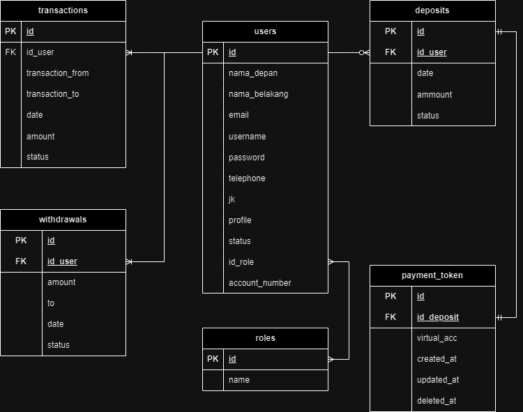

<h1 align="center">SelfBank</h1>

<p align="center">
  Your personal selfbank - Deposit, Withdraw, and more!
</p>

## Features

- Deposit and Withdraw funds
- Secure JWT Authentication
- Midtrans Integration for seamless Payments
- Structured in the MVC pattern
- Powered by Golang and MySQL with GORM

## Technologies Used

- **Language**: Golang
- **Database**: MySQL with GORM
- **Payment Gateway**: Midtrans
- **Authentication**: JWT

## Currently Supported Payment Methods

SelfBank supports the following payment methods:

- Bank Transfer (e.g, BCA, BNI, BRI)
- E-Wallets (e.g., GoPay, OVO) !!Coming Soon!!

## API Documentation

For detailed information on the API endpoints, please refer to our [API Documentation](https://docs.google.com/document/d/1t9QqcgyiKH2Dj-nqPhfKoXru2-d1lIxJwhP8Rcgh25c/edit?usp=sharing).

## Getting Started

1. Clone the repository:

   ```bash
   git clone https://github.com/IrvanWijayaSardam/SelfBank.git
## ERD

<p align="center">
  
</p>
